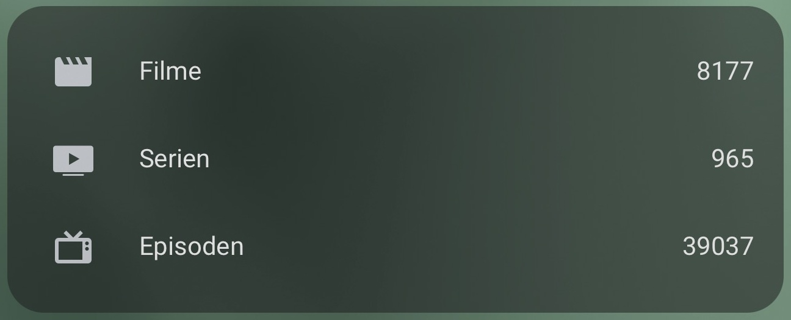
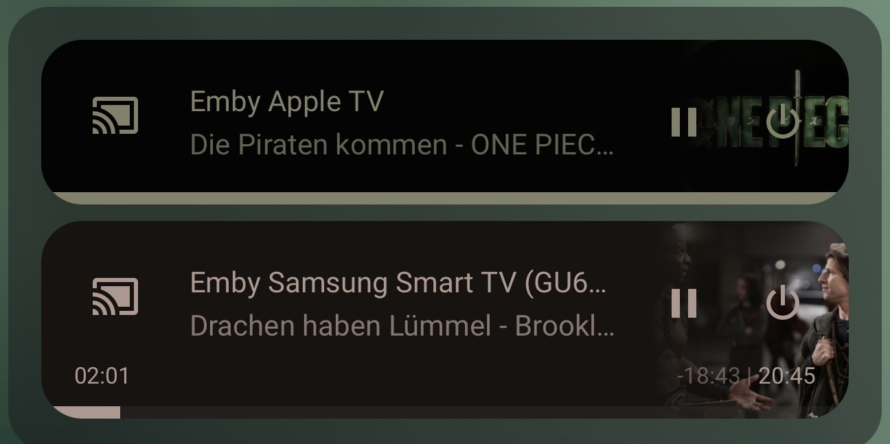

# EMBi – Emby-Integration für Home Assistant

[English](README.md) · **Deutsch**

Was läuft gerade auf dem Fernseher? Wie viele Filme liegen auf dem Emby-Server? Und welche alten Clients werden überhaupt noch gebraucht?

**EMBi verbindet deinen Emby-Server mit Home Assistant.** Die Integration zeigt deine Player und Mediathek an, ermöglicht die Wiedergabesteuerung und hilft dir, die angezeigten Clients übersichtlich zu halten. Verbindung und Steuerung laufen direkt zwischen Home Assistant und deinem Server.

## Das kann EMBi

- **Player anzeigen und steuern:** Wiedergabe, Pause, Stopp und Spulen, soweit der Emby-Client Fernsteuerung unterstützt. Titel, Cover und Fortschritt erscheinen in Home Assistant.
- **Selbst entscheiden, was sichtbar bleibt:** Player beibehalten oder nur während Wiedergabe und Pause anzeigen. Neue Clients lassen sich automatisch aufnehmen; technische Zugriffe kannst du getrennt behandeln.
- **Mediathek im Blick behalten:** Filme, Serien, Episoden, Alben, Musiktitel und aktuell schauende Benutzer als einzeln wählbare Sensoren.
- **Einstellungen erst prüfen, dann übernehmen:** Normale Optionsseiten bearbeiten einen Entwurf. Vor dem Speichern siehst du die Änderungen gesammelt.
- **Alte Geräteeinträge aufräumen:** Auf Wunsch manuell oder automatisch. Die automatische Bereinigung ist bei einer neuen Einrichtung ausgeschaltet.
- **Dashboard nach deinem Geschmack:** Mit normalen HA-Karten oder den [erweiterten Kachelbeispielen](docs/dashboard.md).

## Installation mit HACS

Voraussetzung ist **Home Assistant 2026.7.2 oder neuer** und ein erreichbarer Emby-Server mit API-Schlüssel. Die geprüften HA-Versionen stehen in der [Entwicklungsanleitung](CONTRIBUTING.md). Die Unterstützung einzelner Fernsteuerungsfunktionen hängt vom Emby-Client ab.

1. Öffne HACS und füge `https://github.com/Seger85/home-assistant-embi` als benutzerdefiniertes Repository der Kategorie **Integration** hinzu.
2. Installiere **Emby Integration - EMBi** und starte Home Assistant neu.
3. Öffne **Einstellungen → Geräte & Dienste → Integration hinzufügen** und suche nach **EMBi**.
4. Trage Serveradresse, Port und API-Schlüssel ein. Den Schlüssel erstellst du in der Emby-Serververwaltung. Aktiviere SSL nur bei einem gültig eingerichteten HTTPS-Zugang.
5. Öffne anschließend die Optionen, wenn du Player, Sensoren oder Bereinigung anpassen möchtest.

Der technische Integrationsname lautet weiterhin `emby`. Bestehende Automationen und Entitätsnamen müssen für das Update nicht umbenannt werden.

## Player: sichtbar heißt nicht ständig erreichbar

Ein Player gehört zu einer Kombination aus Emby-Gerätekennung und Client-App. Mehrere Sitzungen derselben Kombination werden zusammengefasst; unterschiedliche Apps können getrennte Player ergeben.

**Player beibehalten** erhält bekannte Player auch außerhalb einer Wiedergabe. Meldet Emby den Client nicht mehr, kann der Player dabei **nicht verfügbar** sein. Das ist kein Grund, ihn aus Home Assistant zu löschen. **Nur aktive Player** zeigt Player während Wiedergabe oder Pause. Eine gespeicherte Ausblendung wird erst umgesetzt, wenn der betreffende Player sicher inaktiv ist.

Aktive und pausierte Player werden bei Bereinigungen geschützt. Nicht eindeutige Antworten, Verbindungsfehler und fehlende Zeitangaben werden nicht als Beweis für Inaktivität verwendet. Da Emby Prüfung und Löschung über getrennte API-Aufrufe anbietet, bleibt ein sehr kleines Zeitfenster zwischen letzter Prüfung und Serverantwort technisch unvermeidbar. Details stehen unter [Bereinigung](docs/server-cleanup.md).

## Sensoren

Alle sieben Sensoren sind bei einer neuen Einrichtung ausgewählt. Du kannst jeden einzeln abwählen. **Die Sensoren werden über die Integration eingerichtet – ohne YAML-Code.** Bei einem Update bleiben deine bisherigen Einstellungen erhalten. Aktiviere den neuen Sensor **Aktive Player** bei Bedarf unter **EMBi → Optionen → Emby-Sensoren**.

| Standard-Entitäts-ID | Bedeutung |
|---|---|
| `sensor.emby_active_players` | Unterschiedliche Emby-Player mit Wiedergabe oder Pause; unabhängig davon, welche Player du in HA einblendest |
| `sensor.emby_movie_count` | Anzahl der Filme |
| `sensor.emby_tv_series_count` | Anzahl der Serien |
| `sensor.emby_tv_episode_count` | Anzahl der Serienepisoden |
| `sensor.emby_album_count` | Anzahl der Musikalben |
| `sensor.emby_song_count` | Anzahl der Musiktitel |
| `sensor.emby_users_watching` | Unterschiedliche Benutzer mit laufender Wiedergabe; pausierte Sitzungen zählen nicht mit |

**Aktive Player und schauende Benutzer sind verschiedene Zahlen.** Ein Benutzer kann mehrere Player verwenden. Der Sensor für aktive Player zählt Wiedergabe und Pause; der Benutzersensor zählt jeden gerade schauenden Benutzer nur einmal.

Ein bestätigtes leeres Ergebnis ergibt `0`. Fehlen gültige Serverdaten, ist der betroffene Sensor nicht verfügbar. Bibliothekszahlen und Benutzeranzeige werden getrennt aktualisiert, damit ein ausgefallener Endpunkt nicht beide Gruppen ausblendet. Bibliothekszahlen und schauende Benutzer werden standardmäßig alle 60 Sekunden aktualisiert. Der Sensor für aktive Player folgt direkt den Sitzungsereignissen und benötigt keine zusätzliche Serverabfrage.

Eigene Entitätsnamen bleiben erhalten. Sind die genannten IDs schon anderweitig belegt oder mehrere Server eingerichtet, verwende die tatsächlich in HA angezeigten IDs. EMBi übernimmt oder löscht keine fremden Template- oder YAML-Sensoren.

## Sprache und Gerätebereinigung

EMBi enthält deutsche und englische Übersetzungen für die Einrichtung, Optionen und Sensornamen. Home Assistant verwendet seine Spracheinstellungen. Eigene Namen und bereits gespeicherte Entitätsnamen werden nicht ungefragt überschrieben. Die README-Sprachlinks dienen der manuellen Auswahl; GitHub und HACS schalten diese Projektbeschreibung nicht automatisch mit der HA-Sprache um.

**Die Bereinigung der Emby-Gerätehistorie erfolgt auf eigene Gefahr.** Sie entfernt ausschließlich ausgewählte alte Geräte-/Client-Einträge. Bibliotheken, Filme, Serien, Musik und Benutzerkonten werden nicht gelöscht. Ein betroffener Client muss sich möglicherweise erneut anmelden. Optional entfernt EMBi auch die zugehörigen eigenen HA-Player-Einträge. Bei einer neuen Einrichtung ist die automatische Bereinigung ausgeschaltet.

EMBi verwendet die Integrationsdomain `emby` und ersetzt damit die eingebaute Emby-Integration. Home Assistants Hinweis „Benutzerdefinierte Integration, die eine Core-Komponente ersetzt“ ist deshalb erwartbar.

## Kachelbeispiele zum Kopieren

Aktiviere die benötigten Sensoren in den EMBi-Optionen. Ersetze gegebenenfalls die Sensor-IDs durch deine eigenen. Die Playerliste verwendet denselben Server wie `sensor.emby_active_players`; ändere diese ID in **beiden** Karten, wenn sie bei dir anders lautet. Ausgeblendete HA-Player fehlen in der Kartenliste, werden im serverweiten Sensor aber weiterhin gezählt.

Für die erste und dritte Karte benötigst du [Mushroom](https://github.com/piitaya/lovelace-mushroom), [auto-entities](https://github.com/thomasloven/lovelace-auto-entities) und [mini-media-player](https://github.com/kalkih/mini-media-player). Die Mediathekskarte ist eine normale HA-Karte. Diese Community-Erweiterungen sind nur für die Beispiele nötig, nicht für EMBi. [Schritt-für-Schritt-Anleitung](docs/dashboard.md).

Die zugeschnittenen Original-Screenshots zeigen ein deutsches Dashboard mit eigenem Theme. Farben, Rundungen und Playerzahl können bei dir abweichen. Der kopierbare Code verwendet die neue numerische Playeranzeige.

### Aktive Player


<details>
<summary>Vollständigen Karten-Code anzeigen</summary>

```yaml
double_tap_action:
  action: none
entity: sensor.emby_active_players
hold_action:
  action: none
icon: mdi:cast-connected
multiline_secondary: true
primary: |-
  
  Aktive Emby-Player derzeit nicht verfügbar
  1 Emby-Player ist aktiv
  {{ count | int }} Emby-Player sind aktiv
secondary: Was läuft gerade? Wiedergabe und Pause im Überblick.
tap_action:
  action: more-info
type: custom:mushroom-template-card
```

</details>

### Mediathek



<details>
<summary>Vollständigen Karten-Code anzeigen</summary>

```yaml
entities:
- entity: sensor.emby_movie_count
  icon: mdi:movie
  name: Filme
- entity: sensor.emby_tv_series_count
  icon: mdi:television-classic
  name: Serien
- entity: sensor.emby_tv_episode_count
  icon: mdi:television-play
  name: Episoden
title: Meine Emby-Mediathek
type: entities
```

</details>

### Player mit Wiedergabe oder Pause



<details>
<summary>Vollständigen Karten-Code anzeigen</summary>

```yaml
card:
  show_header_toggle: false
  state_color: true
  type: entities
filter:
  template: |
    
    
    
      
        
        
        
        
        
        
      
    
    {{ ns.rows }}
show_empty: false
sort:
  method: friendly_name
type: custom:auto-entities
```

</details>

## Update und Rückkehr zu einer älteren Version

Erstelle vor einem größeren Update ein Home-Assistant-Backup. Bestehende EMBi-Player und Sensoren behalten ihre Identität. Neu angelegte Player erhalten zusätzlich eine Zuordnung zu ihrer Integration, damit gleiche Client-Kennungen mehrerer Server nicht kollidieren.

Ein Downgrade allein über HACS stellt deshalb nicht in jedem Fall den alten Registry-Zustand wieder her. Für eine vollständige Rückkehr nutze das Backup von vor dem Update. Die Bereinigung von Emby-Geräteeinträgen lässt sich nur mit einem passenden Emby-Backup vollständig rückgängig machen.

## Hilfe und weitere Informationen

- [Einstellungen verständlich erklärt](docs/configuration.md)
- [Dashboard-Beispiele](docs/dashboard.md)
- [Bereinigung und Wiederherstellung](docs/server-cleanup.md)
- [Probleme eingrenzen](docs/troubleshooting.md)
- [Datenschutz und Sicherheit](docs/security.md)
- [Architektur](docs/architecture.md), [Mitentwickeln](CONTRIBUTING.md) und [Release-Ablauf](RELEASING.md)
- [Änderungen](CHANGELOG.md) und [Workflow-Inventar](docs/workflows.md)

Fehlerberichte und Vorschläge sind über [GitHub Issues](https://github.com/Seger85/home-assistant-embi/issues) willkommen. Bitte nenne EMBi-, HA- und Emby-Version sowie die betroffene Client-App. Prüfe Diagnosedateien und Screenshots vor dem Teilen auf persönliche Informationen.

## Herkunft und Lizenz

Projekt von Seger, entstanden auf Basis der Home-Assistant-Emby-Integration und pyemby. EMBi ist ein Community-Projekt und kein offizielles Produkt von Emby oder Home Assistant. Lizenz: [Apache-2.0](LICENSE); Herkunftshinweise: [NOTICE](NOTICE.md).
