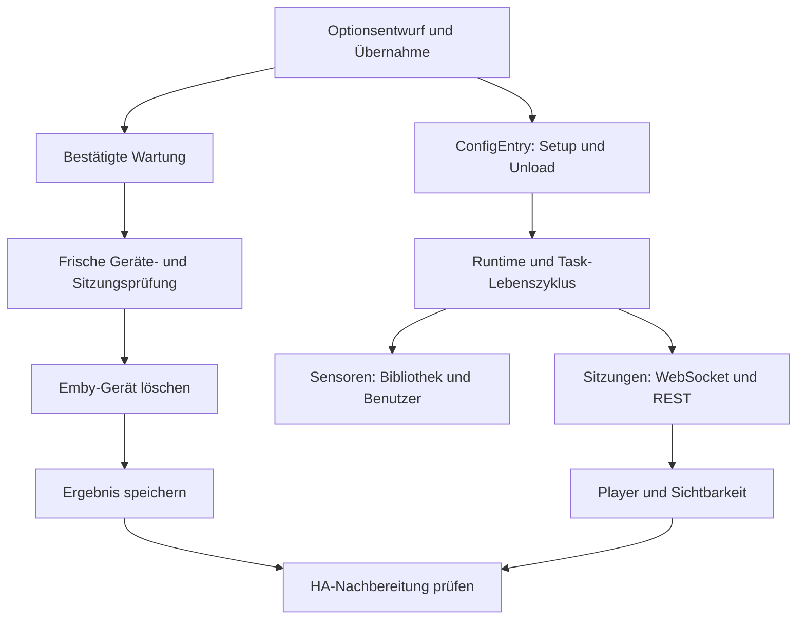

# Architektur

EMBi verwendet Home Assistants ConfigEntry-Lebenszyklus, eine eigene kleine Sitzungsschicht und zwei bedarfsabhängige Sensor-Coordinatoren. Die Aufteilung folgt den unterschiedlichen Datenquellen und Fehlerfolgen.

## Einstieg und Laufzeit

`__init__.py`, `entry_setup.py` und `entry_lifecycle.py` verwalten Setup, Migration, Plattformen, Listener und Unload. `EmbiRuntimeData` bindet API, Sitzungsschicht, Aufgaben, Cache-Zeitpunkte und Wartung an genau eine geladene Entry-Generation. Nach einem Reload darf ein alter Lauf keine neue Runtime mehr verändern. Unload beendet eigene Hintergrundaufgaben und Listener; die gemeinsame HA-HTTP-Session bleibt Eigentum von HA.

`api.py` nutzt diese Session, Authentifizierung im Header, geprüfte HTTPS-Verbindungen und begrenzte Wartezeiten. Geräte- und Sitzungsantworten werden strukturell geprüft. Eine ungültige Antwort gilt nicht als leere Liste.

## Sitzungen und Player

`session_stream.py` lädt zuerst REST-Sitzungen, versucht dann den WebSocket und erneuert den Zustand auch bei ausbleibenden Sitzungspushes per REST. Verbindungsfehler führen zu Wiederholungen und nicht verfügbaren Playern. Bei ungültiger Authentifizierung wird HAs erneute Anmeldung angestoßen. Andere WebSocket-Nachrichten verschieben die Frist zur Sitzungsauffrischung nicht.

`session_state.py` fasst Sitzungen pro `DeviceId.Client` zusammen. Wiedergabe und Pause haben Vorrang vor inaktiven Sitzungen; unklare Daten gelten nicht als sicher inaktiv. `media_player.py` übersetzt Zustand, Metadaten, Fortschritt und Befehle in HA-Entitäten. Cover werden über den HA-Bildproxy mit Header-Authentifizierung geladen; der API-Schlüssel steht nicht in der Bild-URL.

`player_context.py` erstellt den Katalog. `player_actions.py`, `player_reconciliation.py` und `registry_state.py` prüfen Sichtbarkeit und Registry-Eigentum. `player_identity.py` erhält bestehende eindeutige IDs einschließlich wiederherstellbarer Registry-Einträge. Neue Player-IDs enthalten zusätzlich die ConfigEntry-ID. Gleiche Client-IDs verschiedener Server kollidieren dadurch nicht. Es gibt keine Namensheuristik, die einen Client-ID-Wechsel automatisch zusammenführt.

## Sensoren

`sensor.py` erstellt nur die gewählten Sensoren. Bibliothekswerte und laufende Benutzer haben getrennte `DataUpdateCoordinator`-Instanzen; unveränderte Werte lösen keine unnötigen Entity-Updates aus. Authentifizierungsfehler nutzen `ConfigEntryAuthFailed`, andere Abruffehler machen die betreffende Gruppe nicht verfügbar. `sensor_registry.py` behandelt Identitätsmigration und Kollisionen, ohne fremde Entitäten zu übernehmen. Zählwerte sind Momentaufnahmen, keine kumulativen Zähler und keine Energiestatistik; sie erhalten daher keine künstliche `total_increasing`-Semantik.

## Optionen und Wartung

`options_*` trennen Entwurf, Navigation, Anzeige und bestätigte Aktionen. Entwürfe sind tief kopiert; eine veränderte Beschriftung während eines offenen Formulars ändert nicht dessen gespeicherte Player-Zuordnung. `option_validation.py` sichert fehlerhafte gespeicherte Werte ab. Historische Migrationen bleiben in `legacy_migration.py`.

`cleanup.py` plant Kandidaten. `maintenance.py` führt frisch geprüfte Einzellöschungen mit Journal aus. `maintenance_store.py`, `scheduling.py` und `maintenance_recovery.py` trennen Persistenz, Terminberechnung und ausdrücklich bestätigte Wiederherstellung. `registry_*` behandeln erst danach die eigene HA-Nachbereitung. Eine Queue ist keine Erlaubnis zum späteren ungeprüften Löschen. Automatiktermin und zuletzt angezeigter Laufbericht sind getrennte Zustände.

`diagnostics.py` gibt bekannte, redigierte Felder und aggregierte Zustände aus. `reporting.py` unterscheidet Erfolg, Teilfehler, Unterbrechung und ungewisses Serverergebnis. Es gibt keine direkte Manipulation von HAs internen Speicherdateien.

## Tests und Grenzen

`tests/` enthält schnelle Modell- und Regressionstests mit kontrollierten HA-Ersatzobjekten. `tests_ha/` wird in einem getrennten Prozess mit echtem Home Assistant ausgeführt: ConfigEntry, Registry, Store, Plattform-Setup, Reload, Unload, HTTP und WebSocket. So wird nicht nur das Verhalten der Ersatzobjekte abgesichert.

Die CI prüft die in HACS angegebene Mindestversion und eine festgelegte aktuelle HA-Version. Tests mit einem lokalen Emby-Protokollserver ersetzen keine vollständige Matrix aller Emby-Server und Client-Apps. Mobile Darstellung bleibt zusätzlich ein UI-Prüfschritt.
